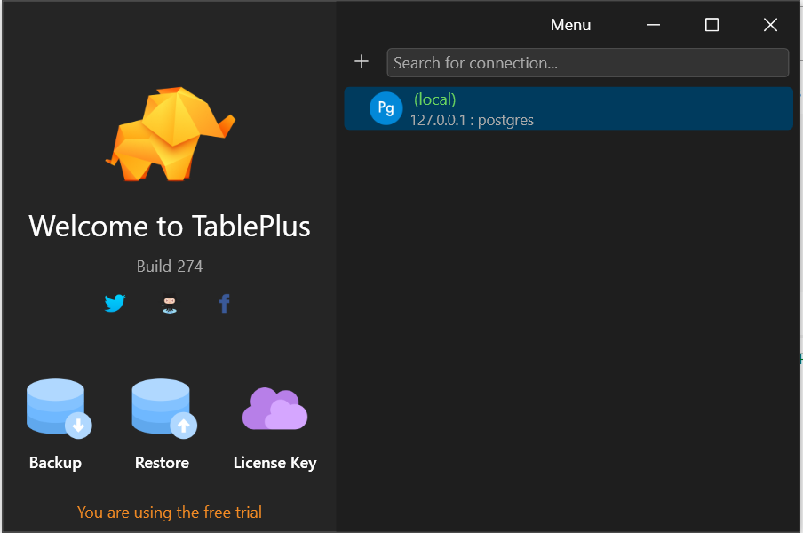

[comment]: # (create a readme file for the project)

# Continaurant API

## Description

This is a RESTful API for managing users, dishes, drinks, and reviews with user authentication and OAuth2 support. The API provides functionality to register, login, and perform CRUD operations on various entities while ensuring data validation and security measures.

## Features

- User Registration and Login with JWT authentication.
- OAuth2 login with Google SSO.
- CRUD operations for users, dishes, drinks, and reviews.
- Rate limiting to prevent abuse.
- Secure password handling with validation.
- Brute force attack prevention.

## Prerequisites

- Go 1.19 or higher
- PostgreSQL 12 or higher
- Docker 


## Getting Started

1. Clone the repository:

```bash
git clone https://github.com/tmpmadula/cantina-shop.git
```


2. Run the following command to start the PostgreSQL database in a Docker container:

```bash
docker-compose up -d cantina-db
```

You can use applications like TablePlus or pgAdmin to connect to the database with the following credentials: 

3. run the following command to build and run the application in docker container:
    
    ```bash
    docker-compose build
    ```

        ```bash
    docker-compose up go-app
    ```

5. The API will be available at `http://localhost:8080`.

## API Endpoints

The API provides the following endpoints:

- `POST /register`: Register a new user.
- `POST /login`: Login with an existing user.
- `POST /oauth2/google`: Login with Google SSO.
- `GET /users`: Get all users.
- `GET /users/{id}`: Get a user by ID.
- `PUT /users/{id}`: Update a user by ID.
- `DELETE /users/{id}`: Delete a user by ID.
- `GET /dishes`: Get all dishes.
- `GET /dishes/{id}`: Get a dish by ID.
- `POST /dishes`: Create a new dish.
- `PUT /dishes/{id}`: Update a dish by ID.
- `DELETE /dishes/{id}`: Delete a dish by ID.
- `GET /drinks`: Get all drinks.
- `GET /drinks/{id}`: Get a drink by ID.
- `POST /drinks`: Create a new drink.
- `PUT /drinks/{id}`: Update a drink by ID.
- `DELETE /drinks/{id}`: Delete a drink by ID.
- `GET /reviews`: Get all reviews.
- `GET /reviews/{id}`: Get a review by ID.
- `POST /reviews`: Create a new review.
- `PUT /reviews/{id}`: Update a review by ID.
- `DELETE /reviews/{id}`: Delete a review by ID.
- `GET /health`: Check the health of the API.
- `GET /metrics`: Get metrics for the API.
- `GET /ready`: Check if the API is ready.

NB: The API requires authentication for most endpoints. You can use the JWT token obtained from the `/login` endpoint or the Google OAuth2 token for authentication.


## Swagger Documentation

This project uses Swagger for API documentation.

### Accessing the Swagger UI

To view the API documentation in your browser, run the server and navigate to:

http://localhost:8000/swagger/index.html

### Generating Swagger Documentation

To generate the Swagger documentation, run the following command:

```sh
swagger generate spec -o ./docs/swagger.json --scan-models
```


# Strategies for Performance Improvement
- Horizontal Scaling
Kubernetes: Deploy your application on Kubernetes to scale horizontally and manage containerized applications efficiently.
Auto Scaling: Use auto-scaling groups to automatically adjust the number of running instances based on traffic load.
- Microservices Architecture
Break down the monolithic application into smaller, independent services that can be developed, deployed, and scaled independently.
- API Gateway
Use an API Gateway to handle load balancing, rate limiting, and authentication, offloading these responsibilities from the application servers.
- Serverless Architecture
Consider using serverless functions (e.g., AWS Lambda, Google Cloud Functions) for certain endpoints to handle unpredictable loads.
- Database Optimization
Use read replicas to distribute the read load across multiple database instances.
Optimize database schema and queries to improve performance.
- Profiling and Monitoring
Implement application performance monitoring (APM) tools like New Relic, Datadog, or Prometheus to continuously monitor performance and identify bottlenecks.